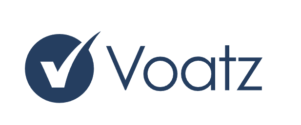

  

# **Universidad Peruana de Ciencias Aplicadas**
## Carrera de Ingeniería de Software

Ciclo: 2025 - 10

Curso: 1ASI0728 Arquitecturas De Software Emergentes

NRC: 2510

Profesor: Rojas Malasquez, Royer Edelwer

“Informe de Trabajo Final"

Startup: -

Producto: VoteChain

Grupo: 5

|          Integrantes          |      Código      |
|:-----------------------------:|:-------------------:|
|  Ramirez Mendez, Sebastian Andre       |    u20191e575    |
|  Sebastian Tasayco, Javier Martin   |    U20211E429    |
|  Ramirez Mendez, Sebastian Andre   |    u20191e575    |

Abril 2025 

---

## Registro de Versiones Del Informe

## Project Report Collaboration Insights

### **Reporte de colaboración de la entrega del TB1:**

------
## Tabla de contenidos
## Capítulo I: Introducción
- 1.1. Startup Profile
  - 1.1.1. Descripción de la Startup
  - 1.1.2. Perfiles de integrantes del equipo
- 1.2. Solution Profile
  - 1.2.1. Antecedentes y problemática
  - 1.2.2. Lean UX Process
    - 1.2.2.1. Lean UX Problem Statements
    - 1.2.2.2. Lean UX Assumptions
    - 1.2.2.3. Lean UX Hypothesis Statements
    - 1.2.2.4. Lean UX Canvas
- 1.3. Segmentos objetivo

## Capítulo II: Requirements Elicitation & Analysis
- 2.1. Competidores
  - 2.1.1. Análisis competitivo
      <table>
    <!-- Título -->
      <tr>
        <th colspan="6" valign="top"><b>Análisis Competitivo</b></th>
      </tr>

      <!-- Motivación del análisis -->
      <tr>
        <td rowspan="2" colspan="1" valign="top">¿Por qué llevar a cabo este Análisis?</td>
        <td colspan="5" valign="top">
          Este análisis permite identificar fortalezas, debilidades y “espacios
          libres” en el mercado de plataformas de votación blockchain, de modo que
          VoteChain priorice características, precios y mensajes de marketing que
          maximicen su adopción en comunidades peruanas y LATAM.
        </td>
      </tr>
      <tr></tr>

      <!-- Cabeceras de competidores (logo + nombre) -->
      <tr>
        <td colspan="2" valign="top"></td>
        <td valign="top">
          
<b>VoteChain</b>

          
        </td>
        <td valign="top">
          
<b>Voatz</b>

          
        </td>
        <td valign="top">
          
<b>Polys</b>

          
        </td>
        <td valign="top">
          
<b>Follow My Vote</b>

          
        </td>
      </tr>

      <!-- PERFIL -->
      <tr>
        <td rowspan="2" valign="top">
Perfil
</td>
        <td valign="top">Overview</td>
        <td valign="top">Plataforma web peruana de votación descentralizada para barrios, universidades, municipios y ONGs.</td>
        <td valign="top">App móvil de voto remoto (iOS / Android) con biometría y cadena privada; pilotos en 8 estados EE. UU. y ligas deportivas.</td>
        <td valign="top">SaaS de Kaspersky con backend blockchain y urna física sincronizada; orientado a gobiernos, universidades y empresas.</td>
        <td valign="top">Solución OSS “end‑to‑end verifiable” sobre blockchain pública; instala‑se on‑premise o en la nube comunitaria.</td>
      </tr>
      <tr>
        <td valign="top">¿Qué valor ofrece a los clientes?</td>
        <td valign="top">Transparencia auditable, gas patrocinado y precios freemium.</td>
        <td valign="top">Permite sufragio seguro de electores remotos con biometría y auditoría postelectoral centralizada.</td>
        <td valign="top">Permite elecciones mixtas (online + presencial) con seguridad Kaspersky y despliegue rápido.</td>
        <td valign="top">Transparencia absoluta (código abierto), auditoría ciudadana y verificación individual del voto.</td>
      </tr>

      <!-- MARKETING -->
      <tr>
        <td rowspan="2" valign="top">
Perfil de Marketing
</td>
        <td valign="top">Mercado objetivo</td>
        <td valign="top">Comunidades de Perú (barrios, universidades, municipios) con proyección Latinoamérica.</td>
        <td valign="top">Electores militares/discapacitados, convenciones partidarias, ligas deportivas US.</td>
        <td valign="top">Ayuntamientos, universidades europeas y cámaras empresariales.</td>
        <td valign="top">ONGs, comunidades pro-democracia y DAOs tecnológicas.</td>
      </tr>
      <tr>
        <td valign="top">Estrategias de marketing</td>
        <td valign="top">Alianzas ONPE / RENIEC; webinars en español; caso de éxito piloto barrial; plan freemium.</td>
        <td valign="top">Relaciones públicas con secretarías estatales; premios de accesibilidad; foco en voto móvil.</td>
        <td valign="top">Contenido de ciber‑seguridad Kaspersky; demos de urna; blog técnico.</td>
        <td valign="top">Campañas open‑source, hackathons y patrocinios de transparencia electoral.</td>
      </tr>

      <!-- PRODUCTO -->
      <tr>
        <td rowspan="3" valign="top">
Perfil de Producto
</td>
        <td valign="top">Productos & Servicios</td>
        <td valign="top">Portal de creación de elecciones, smart‑contracts upgradable, informes en tiempo real.</td>
        <td valign="top">App voto, backend permissioned‑chain, kiosco tablet, portal autoridades y kit auditoría.</td>
        <td valign="top">Plataforma cloud, hardware de urna, votación por correo seguro, API REST.</td>
        <td valign="top">SDK OSS (app voto + app auditor), wallets multisig identidad, servidor verificable.</td>
      </tr>
      <tr>
        <td valign="top">Precios y costos</td>
        <td valign="top">Plan Comunidad (≤500 votos): gratis; Pro US$ 49/mes; Enterprise a medida.</td>
        <td valign="top">Modelo de licencia por jurisdicción + tarifa de soporte (no público).</td>
        <td valign="top">Pago por elección o licencia anual; hardware con coste adicional.</td>
        <td valign="top">Software libre; integración y soporte bajo contrato.</td>
      </tr>
      <tr>
        <td valign="top">Canales de distribución</td>
        <td valign="top">Web app y pasarelas locales (Yape/Plin).</td>
        <td valign="top">App stores y portal web de administración.</td>
        <td valign="top">Web app (cloud) más hardware dedicado.</td>
        <td valign="top">GitHub (auto‑hosting) y nube comunitaria.</td>
      </tr>

      <!-- SWOT -->
      <tr>
        <td rowspan="4" valign="top">
Análisis SWOT
</td>
        <td valign="top">Fortalezas</td>
        <td valign="top">• Cumplimiento legal local • Gas patrocinado → coste ínfimo</td>
        <td valign="top">• Pilotos gubernamentales reales • Biometría integrada</td>
        <td valign="top">• Respaldo Kaspersky • Opción híbrida online/urna</td>
        <td valign="top">• Código 100 % abierto • Verificación individual E2E</td>
      </tr>
      <tr>
        <td valign="top">Debilidades</td>
        <td valign="top">• Capital limitado </td>
        <td valign="top">• Código cerrado; cuestionamientos de transparencia</td>
        <td valign="top">• Percepción geopolítica (origen ruso) • Sin KYC integrado</td>
        <td valign="top">• Escasa tracción institucional • Financiamiento irregular</td>
      </tr>
      <tr>
        <td valign="top">Oportunidades</td>
        <td valign="top">• Ley de gobierno digital Perú • Mercado LATAM poco competido</td>
        <td valign="top">• Voto corporativo y sindical</td>
        <td valign="top">• Demanda post‑COVID de urnas híbridas</td>
        <td valign="top">• Alianzas DAO y ONG de transparencia</td>
      </tr>
      <tr>
        <td valign="top">Amenazas</td>
        <td valign="top">• Desconfianza pública en blockchain • Cambios regulatorios electorales</td>
        <td valign="top">• Auditorías negativas pueden frenar adopción</td>
        <td valign="top">• Posibles sanciones a empresas rusas</td>
        <td valign="top">• Competidores con mayor presupuesto</td>
      </tr>
      </table>
  - 2.1.2. Estrategias y tácticas frente a competidores

      - **Transparencia radical y código abierto**  
      Publicar el repositorio de VoteChain y las auditorías de smart‑contracts para contrastar con soluciones cerradas (Voatz, Polys).

    - **Precios freemium y gas patrocinado**  
      Plan Comunidad gratuito (≤ 500 votantes) y subsidio del gas en Polygon para romper barreras de entrada frente a licencias cerradas.

    - **Alianzas institucionales locales**  
      Convenios con ONPE, RENIEC y municipios piloto; certificación académica con universidades públicas para legitimidad regulatoria.

    - **Educación sobre la blockchain**  
      Webinars, bootcamps y kits de voto blockchain en español para líderes vecinales.

    - **Modo offline y diseño móvil‑first**  
      Acceso estable en zonas con conectividad limitada, ventaja frente a plataformas solo web o apps cerradas.

- 2.2. Entrevistas
  - 2.2.1. Diseño de entrevistas

    ### 1. Preguntas generales  
    - ¿Cuál es tu nombre?   
    - ¿Cuántos años tienes?   
    - ¿Cuál es tu ocupación o rol dentro de la comunidad o institución?   

    - ¿Con qué frecuencia participas en procesos de votación (organizando o votando)?  

    ---

    ### 2. Preguntas — **Segmento: Organizadores de votación comunitaria** 

    1. **Proceso actual** 

      - ¿Cómo gestionas hoy un proceso de votación?  

    2. **Herramientas y tecnología**  

      - ¿Qué herramientas estás utilizando y por qué?  

      - ¿Cuáles de esas herramientas te generan mayor confianza y cuáles menos?  

    3. **Desafíos principales**  

      - ¿Qué problemas enfrentas en términos de transparencia, seguridad o logística? 

      - ¿Cómo impactan el tiempo y el costo en tu capacidad de organizar elecciones?  

    4. **Transparencia y auditoría**  

      - ¿Qué tan fácil es para los votantes y observadores auditar los resultados que publicas?  

      - ¿Has recibido cuestionamientos sobre la legitimidad de una elección?  

    5. **Participación ciudadana**  

      - ¿Cómo motivas a que la gente participe?  

      - ¿Qué obstáculos ves para alcanzar una alta participación?  

    6. **Anonimato y privacidad**  

      - ¿En qué medida te preocupa que los votantes mantengan su anonimato?  

      - ¿Qué prácticas sigues para proteger sus datos personales?  

    7. **Características ideales**  

      - Si pudieras diseñar la plataforma perfecta, ¿qué funciones imprescindibles tendría?  

      - ¿Qué tipo de panel o métricas te ayudarían a supervisar mejor el proceso?  

    8. **Integración y soporte**  

      - ¿Necesitas que se integre con sistemas externos (RENIEC o padrones internos)? 

      - ¿Qué nivel de soporte técnico o capacitación esperarías del proveedor de la plataforma?  

    ---

    ### 3. Preguntas — **Segmento: Ciudadanos votantes** 

    1. **Experiencia de voto actual** 

      - ¿Cómo fue la última vez que votaste en tu comunidad?

      - ¿Qué tan satisfecho/a quedaste con ese proceso?  

    2. **Confianza y transparencia**  

      - ¿Confías en que tu voto se contó correctamente? 

      - ¿Qué evidencias o garantías necesitas para creer en el resultado final?  

    3. **Dificultades y barreras**  

      - ¿Has dejado de votar alguna vez por falta de tiempo, distancia, desconfianza o complejidad tecnológica?  

      - ¿Cuál es tu dispositivo de preferencia (móvil, computadora o ambos)?  

    4. **Anonimato y privacidad**  

      - ¿Qué tan importante es para ti que nadie pueda vincular tu identidad con tu voto?  

      - ¿Qué preocupaciones tienes sobre la seguridad de tus datos personales?  

    5. **Accesibilidad y facilidad de uso**  

      - ¿Prefieres instrucciones paso a paso, vídeos tutoriales u otro formato?  

    6. **Características deseadas** 
     
      - ¿Te gustaría recibir confirmación inmediata de que tu voto fue registrado?  

      - ¿Valoras poder consultar resultados en tiempo real o prefieres un anuncio oficial posterior?   

    7. **Percepción de tecnología blockchain**  
      - ¿Has oído hablar de la votación en blockchain? Y si es así ¿Qué opinas?

      - ¿Qué información o demostraciones te ayudarían a sentirte cómodo usando VoteChain?  

  - 2.2.2. Registro de entrevistas
    
    ### Segmento 1: Organizadores de votación comunitaria
    
     - Nombre: Luis Torres
       
     - Edad: 66 años
       
     - Ocupación: Lider de junta vecinal
       
     - Enlace: https://upcedupe-my.sharepoint.com/:v:/g/personal/u202113640_upc_edu_pe/EULULKQDzrRDjYoEw8v_2ScBYDiAuc8vPjDNKV7qRYOusw?e=Len3sk&nav=eyJyZWZlcnJhbEluZm8iOnsicmVmZXJyYWxBcHAiOiJTdHJlYW1XZWJBcHAiLCJyZWZlcnJhbFZpZXciOiJTaGFyZURpYWxvZy1MaW5rIiwicmVmZXJyYWxBcHBQbGF0Zm9ybSI6IldlYiIsInJlZmVycmFsTW9kZSI6InZpZXcifX0%3D
    
    

     

    - Nombre: Gustavo Zapata

    - Edad: 24 años

    - Ocupación: Presidente de una junta vecinal

    - Enlace: https://upcedupe-my.sharepoint.com/:v:/g/personal/u202113745_upc_edu_pe/EWsgd1gutK5Os40hXVOUm0cB5ufQNNUl_ISlGoAFJVlyZA?nav=eyJyZWZlcnJhbEluZm8iOnsicmVmZXJyYWxBcHAiOiJPbmVEcml2ZUZvckJ1c2luZXNzIiwicmVmZXJyYWxBcHBQbGF0Zm9ybSI6IldlYiIsInJlZmVycmFsTW9kZSI6InZpZXciLCJyZWZlcnJhbFZpZXciOiJNeUZpbGVzTGlua0NvcHkifX0&e=NrclhL

    

     
    
    ### Segmento 2: Ciudadanos votantes
    
  - 2.2.3. Análisis de entrevistas

    ### Segmento 1: Organizadores de votación comunitaria
 
     - Nombre: Luis Torres
   
     - Entrevistador: Alessandro Bernardo
       
        Luis Torres, coordinador electoral de una junta vecinal, gestiona las votaciones de forma semi-digital usando herramientas como Google Forms, Excel y WhatsApp. Los principales problemas incluyen la dificultad para garantizar la seguridad, la transparencia y la auditoría de los resultados. La falta de anonimato, la baja confianza en el proceso y el alto costo en horas voluntarias limitan la participación. Se busca un sistema ideal con autenticación segura, votación anónima pero verificable, conteo transparente y herramientas de supervisión en tiempo real. Estos desafíos generan desconfianza y cuestionamientos sobre la legitimidad de las elecciones.

     

     - Nombre: Gustavo Zapata

     - Entrevistador: Renzo Ramos

        Gustavo Zapata, es el presidente de una junta vecinal de su localidad, quien emplea herramientas tradicionales como la impresión de carteles y cédulas de votación. La única herramientas digital que domina es Word. Realizar estos procesos de votación le cuestan demasiado dinero. Le gustaría que existiera una herramienta donde pueda hacer seguimiento de la cantidad votos en tiempo real y segura.

    ### Segmento 2: Ciudadanos votantes

- 2.3. Needfinding
  - 2.3.1. User Personas
      - **Segmento: Organizadores de votación comunitaria**

        

       

      - **Segmento: Ciudadanos votantes**

        

       

  - 2.3.2. User Task Matrix
      - **Segmento: Organizadores de votación comunitaria**

        | Tarea | Frecuencia | Importancia |
        |-------|------------|-------------|
        | Crear un nuevo proceso de votación | Alta | Alta |
        | Configurar opciones, fechas y reglas de la elección | Alta | Alta |
        | Registrar o cargar el padrón electoral | Media | Alta |
        | Difundir la convocatoria a votación | Alta | Alta |
        | Supervisar la emisión de votos | Alta | Alta |
        | Verificar participación | Media | Alta |
        | Publicar resultados de forma transparente | Alta | Alta |
        | Generar reportes o actas para auditoría | Media | Alta |
        | Atender reclamos o disputas del proceso | Baja | Media |
        | Coordinar con instituciones (municipios, universidades) | Media | Media |

      - **Segmento: Ciudadanos votantes**

        | Tarea | Frecuencia | Importancia |
        |-------|------------|-------------|
        | Recibir convocatoria o notificación de elección | Alta | Alta |
        | Validar identidad y autenticarse para votar | Media | Alta |
        | Emitir voto de manera anónima desde un dispositivo | Alta | Alta |
        | Confirmar que el voto fue registrado correctamente | Alta | Alta |
        | Consultar resultados de la votación | Media | Alta |
        | Acceder a ayuda o tutoriales sobre cómo votar | Media | Media |
        | Confiar en que su voto será contado sin manipulaciones | Alta | Alta |
        | Reportar errores o problemas técnicos | Baja | Media |

  - 2.3.3. Empathy Mapping
       
       - **Segmento: Organizadores de votación comunitaria**
  
        
       

        

       - **Segmento: Ciudadanos votantes**
       
         
       

        
  - 2.3.4. As-is Scenario Mapping

      Este apartado describe el escenario actual de los usuarios antes de utilizar VoteChain, identificando sus acciones, pensamientos y emociones durante los procesos de votación tradicionales.

      **Segmento objetivo: Organizadores de votación comunitaria**

      

       

      **Segmento objetivo: Ciudadanos votantes**

      
- 2.4. Ubiquitous Language
    
    Para el desarrollo de nuestro proyecto, es esencial establecer un lenguaje claro y conciso que refleje las necesidades y expectativas de todos los usuarios. Por esta razón, hemos identificado los siguientes términos clave que serán utilizados de forma consistente por el equipo de negocio y de desarrollo.

    - **Comunidad:** Cualquier barrio, universidad u organización que crea y participa en una elección.  
    - **Organizador:** Usuario que configura reglas, padrón y calendario de votación.  
    - **Votante:** Miembro autorizado a emitir un voto único y anónimo.  
    - **Padrón electoral:** Listado cifrado de votantes, registrado en blockchain como hash verificable.  
    - **Boleta digital:** Voto firmado criptográficamente que se convierte en transacción.  
    - **Smart-contract:** Programa autoejecutable desplegado en una red blockchain que contiene reglas definidas por las partes.  
    - **Transacción:** Registro inmutable de un voto o acción administrativa.  
    - **Tablero de resultados:** Panel en tiempo real que lee eventos del smart-contract.  
    - **Auditoría pública:** Verificación independiente descargando la cadena y recomputando votos.  
    - **Gas patrocinado:** Modelo en el que la plataforma paga las comisiones para que el votante no necesite criptomonedas.
## Capítulo III: Requirements Specification
## 3.1. To-Be Scenario Mapping

  A continuación, se presenta el Mapeo de Escenarios Futuros desarrollado específicamente para este proyecto. Este mapa ofrece una visión estructurada sobre la implementación de mejoras y transformaciones en los procesos y sistemas. Seguidamente, se muestra su       representación gráfica.
  
**Segmento: Organizadores de votación comunitaria** 

  

**Segmento: Ciudadanos votantes** 

  

## 3.2. User Stories
  <table border="1">
  <thead>
    <tr>
      <th>ID</th>
      <th>Épica</th>
    </tr>
  </thead>
  <tbody>
    <tr>
      <td>E1</td>
      <td>Configuración de votaciones descentralizadas</td>
    </tr>
    <tr>
      <td>E2</td>
      <td>Autenticación segura de votantes</td>
    </tr>
    <tr>
      <td>E3</td>
      <td>Emisión de votos anónimos y encriptados</td>
    </tr>
    <tr>
      <td>E4</td>
      <td>Registro inmutable en blockchain</td>
    </tr>
    <tr>
      <td>E5</td>
      <td>Auditoría pública en tiempo real</td>
    </tr>
    <tr>
      <td>E6</td>
      <td>Visualización y publicación de resultados</td>
    </tr>
  </tbody>
</table>

<table border="1">
  <thead>
    <tr>
      <th>Epic / Story ID</th>
      <th>Título</th>
      <th>Descripción</th>
      <th>Criterios de Aceptación</th>
      <th>Relacionado con (Epic ID)</th>
    </tr>
  </thead>
  <tbody>
    <tr>
      <td colspan="5"><strong>Épica E1: Configuración de votaciones descentralizadas</strong> 
        Como ciudadano 
        Quiero configuración de votaciones descentralizadas 
        Para participar de manera confiable y segura en elecciones digitales.
      </td>
    </tr>
    <tr>
      <td>E01_US001</td>
      <td>Definir parámetros de elección</td>
      <td>COMO administrador QUIERO establecer parámetros básicos (nombre, fechas, tipo) PARA iniciar una nueva votación.</td>
      <td>Escenario: En panel de configuración. 
        Dado que el administrador accede al panel, 
        Cuando completa los campos requeridos, 
        Entonces puede guardar los parámetros iniciales.
      </td>
      <td>E1</td>
    </tr>
    <tr>
      <td>E01_US002</td>
      <td>Selección de tipo de elección</td>
      <td>COMO administrador QUIERO elegir entre distintos tipos de votaciones PARA adaptarlas a distintas necesidades.</td>
      <td>Dado que el administrador accede al panel, 
        Cuando selecciona el tipo de elección, 
        Entonces el sistema adapta los campos requeridos.
      </td>
      <td>E1</td>
    </tr>
    <tr>
      <td>E01_US003</td>
      <td>Crear estructura de votación</td>
      <td>COMO administrador QUIERO definir la estructura de cargos o preguntas PARA estructurar adecuadamente la votación.</td>
      <td>Dado que el administrador está creando una elección, 
        Cuando agrega una estructura, 
        Entonces se visualiza en la vista previa.
      </td>
      <td>E1</td>
    </tr>
    <tr>
      <td>E01_US004</td>
      <td>Guardar configuraciones iniciales</td>
      <td>COMO administrador QUIERO guardar toda la configuración PARA reutilizarla en el futuro.</td>
      <td>Dado que completó la configuración, 
        Cuando selecciona guardar, 
        Entonces el sistema confirma que se guardó correctamente.
      </td>
      <td>E1</td>
    </tr>
    <tr>
      <td>E01_US005</td>
      <td>Validación de parámetros</td>
      <td>COMO administrador QUIERO que el sistema valide los parámetros ingresados PARA evitar errores.</td>
      <td>Dado que completó el formulario, 
        Cuando hace clic en guardar, 
        Entonces el sistema muestra errores si falta algún campo obligatorio.
      </td>
      <td>E1</td>
    </tr>
  </tbody>
</table>
==
<table border="1">
  <thead>
    <tr>
      <th>Epic / Story ID</th>
      <th>Título</th>
      <th>Descripción</th>
      <th>Criterios de Aceptación</th>
      <th>Relacionado con (Epic ID)</th>
    </tr>
  </thead>
  <tbody>
    <tr>
      <td colspan="5"><strong>Épica E2: Registro y autenticación de votantes</strong> 
        Como votante 
        Quiero registrarme y autenticarme de manera segura 
        Para poder participar en las elecciones digitales.
      </td>
    </tr>
    <tr>
      <td>E02_US001</td>
      <td>Registro de votantes</td>
      <td>COMO votante QUIERO registrarme previamente PARA acceder a la votación.</td>
      <td>Dado que estoy en la plataforma, 
        Cuando ingreso mis datos, 
        Entonces el sistema debe validarlos y confirmar mi registro.
      </td>
      <td>E2</td>
    </tr>
    <tr>
      <td>E02_US002</td>
      <td>Envío de credenciales</td>
      <td>COMO votante QUIERO recibir credenciales únicas PARA acceder a la plataforma.</td>
      <td>Dado que el registro fue exitoso, 
        Cuando se generan credenciales, 
        Entonces el sistema las envía por un canal seguro.
      </td>
      <td>E2</td>
    </tr>
    <tr>
      <td>E02_US003</td>
      <td>Validación de identidad</td>
      <td>COMO sistema QUIERO validar la identidad del votante PARA garantizar la autenticidad del registro.</td>
      <td>Dado que un votante se registra, 
        Cuando el sistema verifica sus datos, 
        Entonces debe corroborarlos con bases oficiales.
      </td>
      <td>E2</td>
    </tr>
    <tr>
      <td>E02_US004</td>
      <td>Recuperación de credenciales</td>
      <td>COMO votante QUIERO recuperar mis credenciales PARA acceder si las pierdo.</td>
      <td>Dado que soy un votante registrado, 
        Cuando solicito recuperación, 
        Entonces el sistema verifica mi identidad y envía nuevas credenciales.
      </td>
      <td>E2</td>
    </tr>
    <tr>
      <td>E02_US005</td>
      <td>Autenticación de dos factores</td>
      <td>COMO votante QUIERO tener autenticación adicional PARA mayor seguridad en mi acceso.</td>
      <td>Dado que ingreso mis credenciales, 
        Cuando el sistema solicita un segundo factor, 
        Entonces debo completarlo para acceder.
      </td>
      <td>E2</td>
    </tr>
  </tbody>
</table>
==
<table border="1">
  <thead>
    <tr>
      <th>Epic / Story ID</th>
      <th>Título</th>
      <th>Descripción</th>
      <th>Criterios de Aceptación</th>
      <th>Relacionado con (Epic ID)</th>
    </tr>
  </thead>
  <tbody>
    <tr>
      <td colspan="5"><strong>Épica E3: Votación segura y verificable</strong> 
        Como votante 
        Quiero que mi voto sea secreto, único y verificable 
        Para tener confianza en el proceso electoral digital.
      </td>
    </tr>
    <tr>
      <td>E03_US001</td>
      <td>Voto único y anónimo</td>
      <td>COMO votante QUIERO que mi voto sea único y anónimo PARA que no puedan asociarlo conmigo.</td>
      <td>Dado que ingreso al sistema, 
        Cuando voto, 
        Entonces mi identidad no se asocia con el voto emitido.
      </td>
      <td>E3</td>
    </tr>
    <tr>
      <td>E03_US002</td>
      <td>Encriptación del voto</td>
      <td>COMO votante QUIERO que mi voto esté encriptado PARA protegerlo de manipulaciones.</td>
      <td>Dado que elijo una opción, 
        Cuando se emite el voto, 
        Entonces se almacena encriptado con clave pública.
      </td>
      <td>E3</td>
    </tr>
    <tr>
      <td>E03_US003</td>
      <td>Confirmación de voto emitido</td>
      <td>COMO votante QUIERO recibir una confirmación de que mi voto fue recibido PARA asegurarme del proceso.</td>
      <td>Dado que termino de votar, 
        Cuando se envía el voto, 
        Entonces recibo una notificación de éxito.
      </td>
      <td>E3</td>
    </tr>
    <tr>
      <td>E03_US004</td>
      <td>Prevención de doble voto</td>
      <td>COMO votante QUIERO que el sistema impida votar más de una vez PARA garantizar la equidad.</td>
      <td>Dado que ya he votado, 
        Cuando intento votar otra vez, 
        Entonces el sistema lo impide.
      </td>
      <td>E3</td>
    </tr>
    <tr>
      <td>E03_US005</td>
      <td>Revisión previa al envío</td>
      <td>COMO votante QUIERO revisar mi selección antes de enviarla PARA confirmar mi decisión.</td>
      <td>Dado que seleccioné una opción, 
        Cuando hago clic en "Revisar", 
        Entonces veo un resumen antes de confirmar el envío.
      </td>
      <td>E3</td>
    </tr>
  </tbody>
</table>
==
<table border="1">
  <thead>
    <tr>
      <th>Epic / Story ID</th>
      <th>Título</th>
      <th>Descripción</th>
      <th>Criterios de Aceptación</th>
      <th>Relacionado con (Epic ID)</th>
    </tr>
  </thead>
  <tbody>
    <tr>
      <td colspan="5"><strong>Épica E4: Registro inmutable en Blockchain</strong> 
        Como administrador del sistema 
        Quiero que los votos se almacenen en blockchain 
        Para garantizar la integridad e inmutabilidad de los resultados electorales
      </td>
    </tr>
    <tr>
      <td>E04_US001</td>
      <td>Guardado en blockchain</td>
      <td>COMO administrador QUIERO registrar los votos emitidos en la blockchain PARA evitar fraudes.</td>
      <td>Dado que un voto es emitido, 
        Cuando se procesa, 
        Entonces se registra en un bloque inmutable.
      </td>
      <td>E4</td>
    </tr>
    <tr>
      <td>E04_US002</td>
      <td>Verificación de bloques</td>
      <td>COMO administrador QUIERO verificar la integridad de los bloques PARA asegurar consistencia.</td>
      <td>Dado que hay bloques almacenados, 
        Cuando se revisa su hash, 
        Entonces no debe haber alteraciones.
      </td>
      <td>E4</td>
    </tr>
    <tr>
      <td>E04_US003</td>
      <td>Tiempos de registro optimizados</td>
      <td>COMO desarrollador QUIERO que el registro en blockchain sea eficiente PARA no afectar al rendimiento.</td>
      <td>Dado que se emite un voto, 
        Cuando se guarda, 
        Entonces debe demorar menos de 2 segundos en escribirse en el bloque.
      </td>
      <td>E4</td>
    </tr>
    <tr>
      <td>E04_US004</td>
      <td>Alerta por inconsistencia</td>
      <td>COMO administrador QUIERO recibir alertas si hay inconsistencias PARA actuar de inmediato.</td>
      <td>Dado que se detecta una alteración, 
        Cuando un hash no coincide, 
        Entonces se genera una alerta.
      </td>
      <td>E4</td>
    </tr>
    <tr>
      <td>E04_US005</td>
      <td>Registro de auditoría</td>
      <td>COMO desarrollador QUIERO mantener trazabilidad de los bloques PARA fines de auditoría.</td>
      <td>Dado que se registra un bloque, 
        Cuando se almacena, 
        Entonces queda visible su timestamp, hash y autor.
      </td>
      <td>E4</td>
    </tr>
  </tbody>
</table>
==
<table border="1">
  <thead>
    <tr>
      <th>Epic / Story ID</th>
      <th>Título</th>
      <th>Descripción</th>
      <th>Criterios de Aceptación</th>
      <th>Relacionado con (Epic ID)</th>
    </tr>
  </thead>
  <tbody>
    <tr>
      <td colspan="5"><strong>Épica E5: Transparencia y Auditoría Pública</strong> 
        Como ciudadano y auditor 
        Quiero acceso transparente a los datos electorales 
        Para verificar la integridad del proceso democrático
      </td>
    </tr>
    <tr>
      <td>E05_US001</td>
      <td>Acceso público a resultados</td>
      <td>COMO ciudadano QUIERO acceder a los datos de votos en tiempo real PARA auditar la transparencia.</td>
      <td>Dado que se emiten votos, 
        Cuando accedo al panel público, 
        Entonces visualizo el recuento actualizado.
      </td>
      <td>E5</td>
    </tr>
    <tr>
      <td>E05_US002</td>
      <td>Trazabilidad de votos</td>
      <td>COMO auditor QUIERO ver la trazabilidad de los bloques PARA verificar la validez de los registros.</td>
      <td>Dado que accedo a un bloque, 
        Cuando lo abro, 
        Entonces visualizo su historial de cambios (si los hay).
      </td>
      <td>E5</td>
    </tr>
    <tr>
      <td>E05_US003</td>
      <td>Panel público interactivo</td>
      <td>COMO ciudadano QUIERO un panel visual PARA entender los resultados sin ser técnico.</td>
      <td>Dado que accedo a resultados, 
        Cuando entro al panel, 
        Entonces veo gráficos y datos entendibles.
      </td>
      <td>E5</td>
    </tr>
    <tr>
      <td>E05_US004</td>
      <td>Acceso a logs de actividad</td>
      <td>COMO auditor QUIERO ver los logs de actividad del sistema PARA detectar irregularidades.</td>
      <td>Dado que entro a la sección de auditoría, 
        Cuando consulto logs, 
        Entonces puedo filtrar por fechas y acciones.
      </td>
      <td>E5</td>
    </tr>
    <tr>
      <td>E05_US005</td>
      <td>Verificación cruzada</td>
      <td>COMO auditor QUIERO comparar datos entre nodos blockchain PARA asegurar integridad del sistema.</td>
      <td>Dado que consulto un bloque, 
        Cuando lo comparo con nodos espejos, 
        Entonces deben coincidir sus hashes.
      </td>
      <td>E5</td>
    </tr>
  </tbody>
</table>

==

<!-- HU E01_US001 -->
<table>
    <tr>
        <th>HU ID</th>
        <td class="hu-title">E01_US001</td>
    </tr>
    <tr>
        <th>Epic ID</th>
        <td>E1</td>
    </tr>
    <tr>
        <th>Título</th>
        <td>Definir parámetros de elección</td>
    </tr>
    <tr>
        <th>Descripción</th>
        <td>COMO administrador QUIERO establecer parámetros básicos (nombre, fechas, tipo) PARA iniciar una nueva votación.</td>
    </tr>
    <tr>
        <th>Criterios de Aceptación</th>
        <td><strong>Dado que</strong> el administrador accede al panel, 
            <strong>Cuando</strong> completa los campos requeridos, 
            <strong>Entonces</strong> puede guardar los parámetros iniciales.</td>
    </tr>
</table>

<!-- HU E01_US002 -->
<table>
    <tr>
        <th>HU ID</th>
        <td class="hu-title">E01_US002</td>
    </tr>
    <tr>
        <th>Epic ID</th>
        <td>E1</td>
    </tr>
    <tr>
        <th>Título</th>
        <td>Selección de tipo de elección</td>
    </tr>
    <tr>
        <th>Descripción</th>
        <td>COMO administrador QUIERO elegir entre distintos tipos de votaciones PARA adaptarlas a distintas necesidades.</td>
    </tr>
    <tr>
        <th>Criterios de Aceptación</th>
        <td><strong>Dado que</strong> el administrador accede al panel, 
            <strong>Cuando</strong> selecciona el tipo de elección, 
            <strong>Entonces</strong> el sistema adapta los campos requeridos.</td>
    </tr>
</table>

<!-- HU E01_US003 -->
<table>
    <tr>
        <th>HU ID</th>
        <td class="hu-title">E01_US003</td>
    </tr>
    <tr>
        <th>Epic ID</th>
        <td>E1</td>
    </tr>
    <tr>
        <th>Título</th>
        <td>Crear estructura de votación</td>
    </tr>
    <tr>
        <th>Descripción</th>
        <td>COMO administrador QUIERO definir la estructura de cargos o preguntas PARA estructurar adecuadamente la votación.</td>
    </tr>
    <tr>
        <th>Criterios de Aceptación</th>
        <td><strong>Dado que</strong> el administrador está creando una elección, 
            <strong>Cuando</strong> agrega una estructura, 
            <strong>Entonces</strong> se visualiza en la vista previa.</td>
    </tr>
</table>

<!-- HU E01_US004 -->
<table>
    <tr>
        <th>HU ID</th>
        <td class="hu-title">E01_US004</td>
    </tr>
    <tr>
        <th>Epic ID</th>
        <td>E1</td>
    </tr>
    <tr>
        <th>Título</th>
        <td>Guardar configuraciones iniciales</td>
    </tr>
    <tr>
        <th>Descripción</th>
        <td>COMO administrador QUIERO guardar toda la configuración PARA reutilizarla en el futuro.</td>
    </tr>
    <tr>
        <th>Criterios de Aceptación</th>
        <td><strong>Dado que</strong> completó la configuración, 
            <strong>Cuando</strong> selecciona guardar, 
            <strong>Entonces</strong> el sistema confirma que se guardó correctamente.</td>
    </tr>
</table>

<!-- HU E01_US005 -->
<table>
    <tr>
        <th>HU ID</th>
        <td class="hu-title">E01_US005</td>
    </tr>
    <tr>
        <th>Epic ID</th>
        <td>E1</td>
    </tr>
    <tr>
        <th>Título</th>
        <td>Validación de parámetros</td>
    </tr>
    <tr>
        <th>Descripción</th>
        <td>COMO administrador QUIERO que el sistema valide los parámetros ingresados PARA evitar errores.</td>
    </tr>
    <tr>
        <th>Criterios de Aceptación</th>
        <td><strong>Dado que</strong> completó el formulario, 
            <strong>Cuando</strong> hace clic en guardar, 
            <strong>Entonces</strong> el sistema muestra errores si falta algún campo obligatorio.</td>
    </tr>
</table>
==
<!-- HU E02_US001 -->
<table>
    <tr>
        <th>HU ID</th>
        <td class="hu-title">E02_US001</td>
    </tr>
    <tr>
        <th>Epic ID</th>
        <td>E2</td>
    </tr>
    <tr>
        <th>Título</th>
        <td>Registro de votantes</td>
    </tr>
    <tr>
        <th>Descripción</th>
        <td>COMO votante QUIERO registrarme previamente PARA acceder a la votación.</td>
    </tr>
    <tr>
        <th>Criterios de Aceptación</th>
        <td><strong>Dado que</strong> estoy en la plataforma, 
            <strong>Cuando</strong> ingreso mis datos, 
            <strong>Entonces</strong> el sistema debe validarlos y confirmar mi registro.</td>
    </tr>
</table>

<!-- HU E02_US002 -->
<table>
    <tr>
        <th>HU ID</th>
        <td class="hu-title">E02_US002</td>
    </tr>
    <tr>
        <th>Epic ID</th>
        <td>E2</td>
    </tr>
    <tr>
        <th>Título</th>
        <td>Envío de credenciales</td>
    </tr>
    <tr>
        <th>Descripción</th>
        <td>COMO votante QUIERO recibir credenciales únicas PARA acceder a la plataforma.</td>
    </tr>
    <tr>
        <th>Criterios de Aceptación</th>
        <td><strong>Dado que</strong> el registro fue exitoso, 
            <strong>Cuando</strong> se generan credenciales, 
            <strong>Entonces</strong> el sistema las envía por un canal seguro.</td>
    </tr>
</table>

<!-- HU E02_US003 -->
<table>
    <tr>
        <th>HU ID</th>
        <td class="hu-title">E02_US003</td>
    </tr>
    <tr>
        <th>Epic ID</th>
        <td>E2</td>
    </tr>
    <tr>
        <th>Título</th>
        <td>Validación de identidad</td>
    </tr>
    <tr>
        <th>Descripción</th>
        <td>COMO sistema QUIERO validar la identidad del votante PARA garantizar la autenticidad del registro.</td>
    </tr>
    <tr>
        <th>Criterios de Aceptación</th>
        <td><strong>Dado que</strong> un votante se registra, 
            <strong>Cuando</strong> el sistema verifica sus datos, 
            <strong>Entonces</strong> debe corroborarlos con bases oficiales.</td>
    </tr>
</table>

<!-- HU E02_US004 -->
<table>
    <tr>
        <th>HU ID</th>
        <td class="hu-title">E02_US004</td>
    </tr>
    <tr>
        <th>Epic ID</th>
        <td>E2</td>
    </tr>
    <tr>
        <th>Título</th>
        <td>Recuperación de credenciales</td>
    </tr>
    <tr>
        <th>Descripción</th>
        <td>COMO votante QUIERO recuperar mis credenciales PARA acceder si las pierdo.</td>
    </tr>
    <tr>
        <th>Criterios de Aceptación</th>
        <td><strong>Dado que</strong> soy un votante registrado, 
            <strong>Cuando</strong> solicito recuperación, 
            <strong>Entonces</strong> el sistema verifica mi identidad y envía nuevas credenciales.</td>
    </tr>
</table>

<!-- HU E02_US005 -->
<table>
    <tr>
        <th>HU ID</th>
        <td class="hu-title">E02_US005</td>
    </tr>
    <tr>
        <th>Epic ID</th>
        <td>E2</td>
    </tr>
    <tr>
        <th>Título</th>
        <td>Autenticación de dos factores</td>
    </tr>
    <tr>
        <th>Descripción</th>
        <td>COMO votante QUIERO tener autenticación adicional PARA mayor seguridad en mi acceso.</td>
    </tr>
    <tr>
        <th>Criterios de Aceptación</th>
        <td><strong>Dado que</strong> ingreso mis credenciales, 
            <strong>Cuando</strong> el sistema solicita un segundo factor, 
            <strong>Entonces</strong> debo completarlo para acceder.</td>
    </tr>
</table>
==
<!-- HU E03_US001 -->
<table>
    <tr>
        <th>HU ID</th>
        <td class="hu-title">E03_US001</td>
    </tr>
    <tr>
        <th>Epic ID</th>
        <td>E3</td>
    </tr>
    <tr>
        <th>Título</th>
        <td>Voto único y anónimo</td>
    </tr>
    <tr>
        <th>Descripción</th>
        <td>COMO votante QUIERO que mi voto sea único y anónimo PARA que no puedan asociarlo conmigo.</td>
    </tr>
    <tr>
        <th>Criterios de Aceptación</th>
        <td><strong>Dado que</strong> ingreso al sistema, 
            <strong>Cuando</strong> voto, 
            <strong>Entonces</strong> mi identidad no se asocia con el voto emitido.</td>
    </tr>
</table>

<!-- HU E03_US002 -->
<table>
    <tr>
        <th>HU ID</th>
        <td class="hu-title">E03_US002</td>
    </tr>
    <tr>
        <th>Epic ID</th>
        <td>E3</td>
    </tr>
    <tr>
        <th>Título</th>
        <td>Encriptación del voto</td>
    </tr>
    <tr>
        <th>Descripción</th>
        <td>COMO votante QUIERO que mi voto esté encriptado PARA protegerlo de manipulaciones.</td>
    </tr>
    <tr>
        <th>Criterios de Aceptación</th>
        <td><strong>Dado que</strong> elijo una opción, 
            <strong>Cuando</strong> se emite el voto, 
            <strong>Entonces</strong> se almacena encriptado con clave pública.</td>
    </tr>
</table>

<!-- HU E03_US003 -->
<table>
    <tr>
        <th>HU ID</th>
        <td class="hu-title">E03_US003</td>
    </tr>
    <tr>
        <th>Epic ID</th>
        <td>E3</td>
    </tr>
    <tr>
        <th>Título</th>
        <td>Confirmación de voto emitido</td>
    </tr>
    <tr>
        <th>Descripción</th>
        <td>COMO votante QUIERO recibir una confirmación de que mi voto fue recibido PARA asegurarme del proceso.</td>
    </tr>
    <tr>
        <th>Criterios de Aceptación</th>
        <td><strong>Dado que</strong> termino de votar, 
            <strong>Cuando</strong> se envía el voto, 
            <strong>Entonces</strong> recibo una notificación de éxito.</td>
    </tr>
</table>

<!-- HU E03_US004 -->
<table>
    <tr>
        <th>HU ID</th>
        <td class="hu-title">E03_US004</td>
    </tr>
    <tr>
        <th>Epic ID</th>
        <td>E3</td>
    </tr>
    <tr>
        <th>Título</th>
        <td>Prevención de doble voto</td>
    </tr>
    <tr>
        <th>Descripción</th>
        <td>COMO votante QUIERO que el sistema impida votar más de una vez PARA garantizar la equidad.</td>
    </tr>
    <tr>
        <th>Criterios de Aceptación</th>
        <td><strong>Dado que</strong> ya he votado, 
            <strong>Cuando</strong> intento votar otra vez, 
            <strong>Entonces</strong> el sistema lo impide.</td>
    </tr>
</table>

<!-- HU E03_US005 -->
<table>
    <tr>
        <th>HU ID</th>
        <td class="hu-title">E03_US005</td>
    </tr>
    <tr>
        <th>Epic ID</th>
        <td>E3</td>
    </tr>
    <tr>
        <th>Título</th>
        <td>Revisión previa al envío</td>
    </tr>
    <tr>
        <th>Descripción</th>
        <td>COMO votante QUIERO revisar mi selección antes de enviarla PARA confirmar mi decisión.</td>
    </tr>
    <tr>
        <th>Criterios de Aceptación</th>
        <td><strong>Dado que</strong> seleccioné una opción, 
            <strong>Cuando</strong> hago clic en "Revisar", 
            <strong>Entonces</strong> veo un resumen antes de confirmar el envío.</td>
    </tr>
</table>
==
<!-- HU E04_US001 -->
<table class="blockchain-feature">
    <tr>
        <th>HU ID</th>
        <td class="hu-title">E04_US001</td>
    </tr>
    <tr>
        <th>Epic ID</th>
        <td>E4</td>
    </tr>
    <tr>
        <th>Título</th>
        <td>Guardado en blockchain</td>
    </tr>
    <tr>
        <th>Descripción</th>
        <td>COMO administrador QUIERO registrar los votos emitidos en la blockchain PARA evitar fraudes.</td>
    </tr>
    <tr>
        <th>Criterios de Aceptación</th>
        <td><strong>Dado que</strong> un voto es emitido, 
            <strong>Cuando</strong> se procesa, 
            <strong>Entonces</strong> se registra en un bloque inmutable.</td>
    </tr>
</table>

<!-- HU E04_US002 -->
<table class="blockchain-feature">
    <tr>
        <th>HU ID</th>
        <td class="hu-title">E04_US002</td>
    </tr>
    <tr>
        <th>Epic ID</th>
        <td>E4</td>
    </tr>
    <tr>
        <th>Título</th>
        <td>Verificación de bloques</td>
    </tr>
    <tr>
        <th>Descripción</th>
        <td>COMO administrador QUIERO verificar la integridad de los bloques PARA asegurar consistencia.</td>
    </tr>
    <tr>
        <th>Criterios de Aceptación</th>
        <td><strong>Dado que</strong> hay bloques almacenados, 
            <strong>Cuando</strong> se revisa su hash, 
            <strong>Entonces</strong> no debe haber alteraciones.</td>
    </tr>
</table>

<!-- HU E04_US003 -->
<table class="blockchain-feature">
    <tr>
        <th>HU ID</th>
        <td class="hu-title">E04_US003</td>
    </tr>
    <tr>
        <th>Epic ID</th>
        <td>E4</td>
    </tr>
    <tr>
        <th>Título</th>
        <td>Tiempos de registro optimizados</td>
    </tr>
    <tr>
        <th>Descripción</th>
        <td>COMO desarrollador QUIERO que el registro en blockchain sea eficiente PARA no afectar al rendimiento.</td>
    </tr>
    <tr>
        <th>Criterios de Aceptación</th>
        <td><strong>Dado que</strong> se emite un voto, 
            <strong>Cuando</strong> se guarda, 
            <strong>Entonces</strong> debe demorar menos de 2 segundos en escribirse en el bloque.</td>
    </tr>
</table>

<!-- HU E04_US004 -->
<table class="blockchain-feature">
    <tr>
        <th>HU ID</th>
        <td class="hu-title">E04_US004</td>
    </tr>
    <tr>
        <th>Epic ID</th>
        <td>E4</td>
    </tr>
    <tr>
        <th>Título</th>
        <td>Alerta por inconsistencia</td>
    </tr>
    <tr>
        <th>Descripción</th>
        <td>COMO administrador QUIERO recibir alertas si hay inconsistencias PARA actuar de inmediato.</td>
    </tr>
    <tr>
        <th>Criterios de Aceptación</th>
        <td><strong>Dado que</strong> se detecta una alteración, 
            <strong>Cuando</strong> un hash no coincide, 
            <strong>Entonces</strong> se genera una alerta.</td>
    </tr>
</table>

<!-- HU E04_US005 -->
<table class="blockchain-feature">
    <tr>
        <th>HU ID</th>
        <td class="hu-title">E04_US005</td>
    </tr>
    <tr>
        <th>Epic ID</th>
        <td>E4</td>
    </tr>
    <tr>
        <th>Título</th>
        <td>Registro de auditoría</td>
    </tr>
    <tr>
        <th>Descripción</th>
        <td>COMO desarrollador QUIERO mantener trazabilidad de los bloques PARA fines de auditoría.</td>
    </tr>
    <tr>
        <th>Criterios de Aceptación</th>
        <td><strong>Dado que</strong> se registra un bloque, 
            <strong>Cuando</strong> se almacena, 
            <strong>Entonces</strong> queda visible su timestamp, hash y autor.</td>
    </tr>
</table>
==
<!-- HU E05_US001 -->
<table class="transparency-feature">
    <tr>
        <th>HU ID</th>
        <td class="hu-title">E05_US001</td>
    </tr>
    <tr>
        <th>Epic ID</th>
        <td>E5</td>
    </tr>
    <tr>
        <th>Título</th>
        <td>Acceso público a resultados</td>
    </tr>
    <tr>
        <th>Descripción</th>
        <td>COMO ciudadano QUIERO acceder a los datos de votos en tiempo real PARA auditar la transparencia.</td>
    </tr>
    <tr>
        <th>Criterios de Aceptación</th>
        <td><strong>Dado que</strong> se emiten votos, 
            <strong>Cuando</strong> accedo al panel público, 
            <strong>Entonces</strong> visualizo el recuento actualizado.</td>
    </tr>
</table>

<!-- HU E05_US002 -->
<table class="transparency-feature">
    <tr>
        <th>HU ID</th>
        <td class="hu-title">E05_US002</td>
    </tr>
    <tr>
        <th>Epic ID</th>
        <td>E5</td>
    </tr>
    <tr>
        <th>Título</th>
        <td>Trazabilidad de votos</td>
    </tr>
    <tr>
        <th>Descripción</th>
        <td>COMO auditor QUIERO ver la trazabilidad de los bloques PARA verificar la validez de los registros.</td>
    </tr>
    <tr>
        <th>Criterios de Aceptación</th>
        <td><strong>Dado que</strong> accedo a un bloque, 
            <strong>Cuando</strong> lo abro, 
            <strong>Entonces</strong> visualizo su historial de cambios (si los hay).</td>
    </tr>
</table>

<!-- HU E05_US003 -->
<table class="transparency-feature">
    <tr>
        <th>HU ID</th>
        <td class="hu-title">E05_US003</td>
    </tr>
    <tr>
        <th>Epic ID</th>
        <td>E5</td>
    </tr>
    <tr>
        <th>Título</th>
        <td>Panel público interactivo</td>
    </tr>
    <tr>
        <th>Descripción</th>
        <td>COMO ciudadano QUIERO un panel visual PARA entender los resultados sin ser técnico.</td>
    </tr>
    <tr>
        <th>Criterios de Aceptación</th>
        <td><strong>Dado que</strong> accedo a resultados, 
            <strong>Cuando</strong> entro al panel, 
            <strong>Entonces</strong> veo gráficos y datos entendibles.</td>
    </tr>
</table>

<!-- HU E05_US004 -->
<table class="transparency-feature">
    <tr>
        <th>HU ID</th>
        <td class="hu-title">E05_US004</td>
    </tr>
    <tr>
        <th>Epic ID</th>
        <td>E5</td>
    </tr>
    <tr>
        <th>Título</th>
        <td>Acceso a logs de actividad</td>
    </tr>
    <tr>
        <th>Descripción</th>
        <td>COMO auditor QUIERO ver los logs de actividad del sistema PARA detectar irregularidades.</td>
    </tr>
    <tr>
        <th>Criterios de Aceptación</th>
        <td><strong>Dado que</strong> entro a la sección de auditoría, 
            <strong>Cuando</strong> consulto logs, 
            <strong>Entonces</strong> puedo filtrar por fechas y acciones.</td>
    </tr>
</table>

<!-- HU E05_US005 -->
<table class="transparency-feature">
    <tr>
        <th>HU ID</th>
        <td class="hu-title">E05_US005</td>
    </tr>
    <tr>
        <th>Epic ID</th>
        <td>E5</td>
    </tr>
    <tr>
        <th>Título</th>
        <td>Verificación cruzada</td>
    </tr>
    <tr>
        <th>Descripción</th>
        <td>COMO auditor QUIERO comparar datos entre nodos blockchain PARA asegurar integridad del sistema.</td>
    </tr>
    <tr>
        <th>Criterios de Aceptación</th>
        <td><strong>Dado que</strong> consulto un bloque, 
            <strong>Cuando</strong> lo comparo con nodos espejos, 
            <strong>Entonces</strong> deben coincidir sus hashes.</td>
    </tr>
</table>

- 3.3. Impact Mapping

  

- 3.4. Product Backlog

<table border="1">
  <thead>
    <tr>
      <th>Orden</th>
      <th>HU ID</th>
      <th>Título</th>
      <th>Descripción</th>
      <th>Story Points</th>
    </tr>
  </thead>
  <tbody>
    <tr>
      <td>1</td>
      <td>E01_US001</td>
      <td>Definir parámetros de elección</td>
      <td>COMO administrador QUIERO establecer parámetros básicos (nombre, fechas, tipo) PARA iniciar una nueva votación.</td>
      <td>3</td>
    </tr>
    <tr>
      <td>2</td>
      <td>E01_US002</td>
      <td>Selección de tipo de elección</td>
      <td>COMO administrador QUIERO elegir entre distintos tipos de votaciones PARA adaptarlas a distintas necesidades.</td>
      <td>2</td>
    </tr>
    <tr>
      <td>3</td>
      <td>E01_US005</td>
      <td>Validación de parámetros</td>
      <td>COMO administrador QUIERO que el sistema valide los parámetros ingresados PARA evitar errores.</td>
      <td>3</td>
    </tr>
    <tr>
      <td>4</td>
      <td>E01_US003</td>
      <td>Crear estructura de votación</td>
      <td>COMO administrador QUIERO definir la estructura de cargos o preguntas PARA estructurar adecuadamente la votación.</td>
      <td>5</td>
    </tr>
    <tr>
      <td>5</td>
      <td>E01_US004</td>
      <td>Guardar configuraciones iniciales</td>
      <td>COMO administrador QUIERO guardar toda la configuración PARA reutilizarla en el futuro.</td>
      <td>2</td>
    </tr>
    <tr>
      <td>6</td>
      <td>E02_US001</td>
      <td>Registro de votantes</td>
      <td>COMO votante QUIERO registrarme previamente PARA acceder a la votación.</td>
      <td>3</td>
    </tr>
    <tr>
      <td>7</td>
      <td>E02_US003</td>
      <td>Validación de identidad</td>
      <td>COMO sistema QUIERO validar la identidad del votante PARA garantizar la autenticidad del registro.</td>
      <td>5</td>
    </tr>
    <tr>
      <td>8</td>
      <td>E02_US002</td>
      <td>Envío de credenciales</td>
      <td>COMO votante QUIERO recibir credenciales únicas PARA acceder a la plataforma.</td>
      <td>3</td>
    </tr>
    <tr>
      <td>9</td>
      <td>E02_US005</td>
      <td>Autenticación de dos factores</td>
      <td>COMO votante QUIERO tener autenticación adicional PARA mayor seguridad en mi acceso.</td>
      <td>5</td>
    </tr>
    <tr>
      <td>10</td>
      <td>E02_US004</td>
      <td>Recuperación de credenciales</td>
      <td>COMO votante QUIERO recuperar mis credenciales PARA acceder si las pierdo.</td>
      <td>3</td>
    </tr>
    <tr>
      <td>11</td>
      <td>E03_US001</td>
      <td>Voto único y anónimo</td>
      <td>COMO votante QUIERO que mi voto sea único y anónimo PARA que no puedan asociarlo conmigo.</td>
      <td>5</td>
    </tr>
    <tr>
      <td>12</td>
      <td>E03_US002</td>
      <td>Encriptación del voto</td>
      <td>COMO votante QUIERO que mi voto esté encriptado PARA protegerlo de manipulaciones.</td>
      <td>8</td>
    </tr>
    <tr>
      <td>13</td>
      <td>E03_US004</td>
      <td>Prevención de doble voto</td>
      <td>COMO votante QUIERO que el sistema impida votar más de una vez PARA garantizar la equidad.</td>
      <td>5</td>
    </tr>
    <tr>
      <td>14</td>
      <td>E03_US005</td>
      <td>Revisión previa al envío</td>
      <td>COMO votante QUIERO revisar mi selección antes de enviarla PARA confirmar mi decisión.</td>
      <td>2</td>
    </tr>
    <tr>
      <td>15</td>
      <td>E03_US003</td>
      <td>Confirmación de voto emitido</td>
      <td>COMO votante QUIERO recibir una confirmación de que mi voto fue recibido PARA asegurarme del proceso.</td>
      <td>2</td>
    </tr>
    <tr>
      <td>16</td>
      <td>E04_US001</td>
      <td>Guardado en blockchain</td>
      <td>COMO administrador QUIERO registrar los votos emitidos en la blockchain PARA evitar fraudes.</td>
      <td>8</td>
    </tr>
    <tr>
      <td>17</td>
      <td>E04_US002</td>
      <td>Verificación de bloques</td>
      <td>COMO administrador QUIERO verificar la integridad de los bloques PARA asegurar consistencia.</td>
      <td>5</td>
    </tr>
    <tr>
      <td>18</td>
      <td>E04_US003</td>
      <td>Tiempos de registro optimizados</td>
      <td>COMO desarrollador QUIERO que el registro en blockchain sea eficiente PARA no afectar al rendimiento.</td>
      <td>5</td>
    </tr>
    <tr>
      <td>19</td>
      <td>E04_US004</td>
      <td>Alerta por inconsistencia</td>
      <td>COMO administrador QUIERO recibir alertas si hay inconsistencias PARA actuar de inmediato.</td>
      <td>3</td>
    </tr>
    <tr>
      <td>20</td>
      <td>E04_US005</td>
      <td>Registro de auditoría</td>
      <td>COMO desarrollador QUIERO mantener trazabilidad de los bloques PARA fines de auditoría.</td>
      <td>3</td>
    </tr>
    <tr>
      <td>21</td>
      <td>E05_US001</td>
      <td>Acceso público a resultados</td>
      <td>COMO ciudadano QUIERO acceder a los datos de votos en tiempo real PARA auditar la transparencia.</td>
      <td>3</td>
    </tr>
    <tr>
      <td>22</td>
      <td>E05_US003</td>
      <td>Panel público interactivo</td>
      <td>COMO ciudadano QUIERO un panel visual PARA entender los resultados sin ser técnico.</td>
      <td>5</td>
    </tr>
    <tr>
      <td>23</td>
      <td>E05_US002</td>
      <td>Trazabilidad de votos</td>
      <td>COMO auditor QUIERO ver la trazabilidad de los bloques PARA verificar la validez de los registros.</td>
      <td>5</td>
    </tr>
    <tr>
      <td>24</td>
      <td>E05_US004</td>
      <td>Acceso a logs de actividad</td>
      <td>COMO auditor QUIERO ver los logs de actividad del sistema PARA detectar irregularidades.</td>
      <td>3</td>
    </tr>
    <tr>
      <td>25</td>
      <td>E05_US005</td>
      <td>Verificación cruzada</td>
      <td>COMO auditor QUIERO comparar datos entre nodos blockchain PARA asegurar integridad del sistema.</td>
      <td>5</td>
    </tr>
  </tbody>
</table>

## Capítulo IV: Strategic-Level Software Design
- 4.1. Strategic-Level Attribute-Driven Design
  - 4.1.1. Design Purpose
  - 4.1.2. Attribute-Driven Design Inputs
    - 4.1.2.1. Primary Functionality (Primary User Stories)
    - 4.1.2.2. Quality Attribute Scenarios
    - 4.1.2.3. Constraints
  - 4.1.3. Architectural Drivers Backlog
  - 4.1.4. Architectural Design Decisions
  - 4.1.5. Quality Attribute Scenario Refinements
- 4.2. Strategic-Level Domain-Driven Design
  - 4.2.1. EventStorming
  - 4.2.2. Candidate Context Discovery
  - 4.2.3. Domain Message Flows Modeling
  - 4.2.4. Bounded Context Canvases
  - 4.2.5. Context Mapping
- 4.3. Software Architecture
  - 4.3.1. Software Architecture System Landscape Diagram
  - 4.3.2. Software Architecture Context Level Diagrams
  - 4.3.3. Software Architecture Container Level Diagrams
  - 4.3.4. Software Architecture Deployment Diagrams

## Capítulo V: Tactical-Level Software Design
- 5.X. Bounded Context: <Bounded Context Name>
  - 5.X.1. Domain Layer
  - 5.X.2. Interface Layer
  - 5.X.3. Application Layer
  - 5.X.4. Infrastructure Layer
  - 5.X.6. Bounded Context Software Architecture Component Level Diagrams
  - 5.X.7. Bounded Context Software Architecture Code Level Diagrams
    - 5.X.7.1. Bounded Context Domain Layer Class Diagrams
    - 5.X.7.2. Bounded Context Database Design Diagram

## Capítulo VI: Solution UX Design
- 6.1. Style Guidelines
  - 6.1.1. General Style Guidelines
  - 6.1.2. Web, Mobile & Devices Style Guidelines
- 6.2. Information Architecture
  - 6.2.2. Labeling Systems
  - 6.2.3. Searching Systems
  - 6.2.4. SEO Tags and Meta Tags
  - 6.2.5. Navigation Systems
- 6.3. Landing Page UI Design
  - 6.3.1. Landing Page Wireframe
  - 6.3.2. Landing Page Mock-up
- 6.4. Applications UX/UI Design
  - 6.4.1. Applications Wireframes
  - 6.4.2. Applications Wireflow Diagrams
  - 6.4.3. Applications Mock-ups
  - 6.4.4. Applications User Flow Diagrams
- 6.5. Applications Prototyping

## Capítulo VII: Product Implementation, Validation & Deployment
- 7.1. Software Configuration Management
  - 7.1.1. Software Development Environment Configuration
  - 7.1.2. Source Code Management
  - 7.1.3. Source Code Style Guide & Conventions
  - 7.1.4. Software Deployment Configuration
- 7.2. Solution Implementation
  - 7.2.X. Sprint n
    - 7.2.X.1. Sprint Planning n
    - 7.2.X.2. Sprint Backlog n
    - 7.2.X.3. Development Evidence for Sprint Review
    - 7.2.X.4. Testing Suite Evidence for Sprint Review
    - 7.2.X.5. Execution Evidence for Sprint Review
    - 7.2.X.6. Services Documentation Evidence for Sprint Review
    - 7.2.X.7. Software Deployment Evidence for Sprint Review
    - 7.2.X.8. Team Collaboration Insights during Sprint
- 7.3. Validation Interviews
  - 7.3.1. Diseño de entrevistas
  - 7.3.2. Registro de entrevistas
  - 7.3.3. Evaluaciones según heurísticas
- 7.4. Video About-the-Product

## Conclusiones
- Conclusiones y recomendaciones
- Video About-the-Team

## Bibliografía

## Anexos

# Contenido
## Capítulo I: Introducción 

## 1.1. Startup Profile

### 1.1.1. Descripción de la Startup

VoteChain es una startup tecnológica peruana enfocada en revolucionar los procesos de votación mediante soluciones basadas en blockchain. Surge como respuesta a la creciente necesidad de transparencia, eficiencia y participación ciudadana en contextos donde la confianza en los procesos electorales o de toma de decisiones colectivas se ha visto debilitada.

Nuestra plataforma permite a comunidades organizadas —como barrios, universidades, municipios, colectivos ciudadanos, organizaciones sociales y proyectos abiertos— tomar decisiones democráticas de forma digital, segura y descentralizada. Al registrar cada voto como una transacción única en una cadena de bloques, garantizamos que estos sean inmutables, auditables, anónimos y libres de manipulación.

VoteChain no solo propone una alternativa tecnológica, sino también una nueva forma de participación, en la que cada voz cuenta, sin necesidad de intermediarios centralizados ni procesos complejos. Apostamos por una ciudadanía más informada, activa y conectada, con herramientas que refuercen la gobernanza local e institucional.

---

#### 🧭 Misión

Desarrollar e implementar soluciones tecnológicas innovadoras que transformen los procesos de votación y toma de decisiones colectivas, garantizando transparencia, seguridad y participación ciudadana efectiva mediante el uso de tecnología blockchain.

---

#### 🌍 Visión

Ser la plataforma líder en votaciones descentralizadas a nivel nacional e internacional, reconocida por fomentar la confianza, la equidad y la innovación en la participación democrática de comunidades, organizaciones e instituciones públicas y privadas.

---

### 1.1.2. Perfiles de integrantes de grupo

Los siguientes integrantes del grupo son presentados con su carrera y sus conocimientos relevantes al desarrollo de este proyecto.

<table>
  <tr>
    <th>
      
    </th>
    <td valign="top">
      
<b>Ramírez Méndez, Sebastián André</b>

      

        Soy una persona entusiasta que disfruta colaborar en equipo, y me caracterizo por ser transparente en mis objetivos y en mi enfoque de trabajo. Me enorgullece la capacidad que tengo para complementar a mi equipo en áreas donde puedan necesitar apoyo. Mi pasión por mi carrera me impulsa a desafiar mis habilidades y aspirar a alcanzar todo su potencial.
      

    </td>
  </tr>
  <tr>
    <th>
      
    </th>
    <td valign="top">
      
<b>Sebastian Tasayco, Javier Martin</b>

      

        Soy Martin Sebastian, estudio la carrera de Ingeniería de Software tengo experiencia en desarrollo web y metodologías ágiles. Dentro del proyecto me comprometo participo activamente en el análisis y diseño de soluciones, aportando una visión centrada en la usabilidad y la eficiencia del sistema. Me motiva crear tecnologías que generen impacto, y contribuyo al equipo combinando habilidades técnicas con orientación al trabajo colaborativo y a la mejora continua.
      

    </td>
  </tr>
  <tr>
    <th>
      
    </th>
    <td valign="top">
      
<b>Ramos Ramirez, Renzo Manuel</b>

      

        Mi nombre es Renzo Ramos, soy un estudiante de la carrera Ingeniería de Software. Me interesa mucho el desarrollo de aplicaciones tanto web como móviles. También valoro mucho el trabajo en equipo y siempre trato de mantener una buena comunicación con mis compañeros. Siempre busco mejorar como desarrollador con cada proyecto.
      

    </td>
  </tr>
  <tr>
    <th>
      
    </th>
    <td valign="top">
      
<b>Bernardo Eusebio, Alessandro Joaquin</b>

      

        Soy Alessandro Joaquin Bernardo Eusebio, estudiante de octavo semestre de Ingeniería de Software. Me apasiona el desarrollo de soluciones tecnológicas que generen un impacto positivo en las personas. A lo largo de mi carrera, he enfocado mi aprendizaje en áreas como la inteligencia artificial, la visión computacional y la gestión de proyectos. Actualmente, participo en proyectos que combinan tecnología y bienestar humano, buscando siempre crecer como profesional y aportar de manera significativa en cada equipo del que formo parte.
      

    </td>
  </tr>
  <tr>
    <th>
      
    </th>
    <td valign="top">
      
<b>Castillo Robles, Steve Roger</b>

      

        Soy Steve Castillo, estudiante de la carrera de Ingeniería de Software, apasionado por el desarrollo full-stack y enfocado en aprender y aplicar tecnologías modernas para crear soluciones eficientes que generen un impacto positivo en cada proyecto, con experiencia en desarrollo y migración de aplicaciones heredadas con jQuery a tecnologías modernas como React.js, generación y análisis de datos utilizando Power BI, Excel y bases de datos cloud, diseño y optimización de bases de datos para nuevos proyectos con PostgreSQL, desarrollo de aplicaciones mobile-first con React.js y Tailwind CSS, y aplicación de principios de arquitectura limpia y patrones como DDD y MVC, destacando mis aptitudes en desarrollo frontend con Angular, React.js y Vue.js, desarrollo backend con Spring Boot, MySQL y PostgreSQL, y el uso de herramientas adicionales como Figma, Power BI y Docker.
      

    </td>
  </tr>
</table>

## 1.2. Solution Profile

Esta sección presenta el perfil de solución propuesto para abordar la problemática identificada. Se estructura en dos partes: los antecedentes y la problemática que justifican la necesidad de nuestra solución, y el proceso Lean UX utilizado para diseñar una plataforma centrada en las necesidades reales de los usuarios.

### 1.2.1. Antecedentes y problemática

**Antecedentes:**

La participación ciudadana es un pilar fundamental en las sociedades democráticas. Sin embargo, en muchas comunidades, tanto urbanas como rurales, los procesos de toma de decisiones suelen estar marcados por la falta de transparencia, baja participación y ausencia de herramientas tecnológicas que garanticen la legitimidad de los resultados.

A nivel global, se han reportado múltiples iniciativas para modernizar los sistemas de votación mediante plataformas digitales, pero la mayoría de estas aún dependen de entidades centralizadas, lo que puede generar desconfianza en su gestión. Según el informe “Digital Democracy Trends 2023” (CivicTech Monitor), el 67% de los ciudadanos encuestados en América Latina indicó que estaría más dispuesto a participar si los procesos fueran accesibles, seguros y anónimos desde medios digitales.

En Perú, experiencias previas de presupuestos participativos y votaciones comunales han evidenciado limitaciones como el clientelismo, falta de registros auditables y baja accesibilidad a medios digitales seguros. Asimismo, según la Defensoría del Pueblo (2022), cerca del 40% de los procesos de consulta vecinal no contaron con mecanismos que garanticen la veracidad de los resultados ni la participación representativa.

**Problemática:**

Pese a la existencia de canales participativos, estos no siempre aseguran una votación justa, transparente o inclusiva. En muchas comunidades y organizaciones (como asociaciones estudiantiles, vecinales o culturales), las decisiones se toman a través de métodos tradicionales: votaciones a mano alzada, encuestas sin verificación, o por decisiones centralizadas que no recogen el consenso real.

Además, existe una profunda desconfianza en el conteo de votos, manipulación de resultados y la ausencia de herramientas que auditen el proceso de forma pública y transparente.

**Solución:**

VoteChain propone una plataforma web descentralizada que permite a cualquier comunidad organizar y ejecutar votaciones seguras, auditables, anónimas e inmutables utilizando tecnología blockchain. La solución elimina intermediarios, garantiza la integridad de cada voto emitido y fortalece la confianza colectiva en los procesos democráticos digitales.

---

### 5W’s y 2H’s

**What (¿Qué se está haciendo?):**  
Una plataforma web descentralizada de votación, basada en tecnología blockchain, que permite realizar elecciones digitales seguras, transparentes y anónimas en cualquier comunidad organizada.

**Why (¿Por qué se está haciendo?):**  
Porque los métodos actuales de votación en comunidades son poco confiables, vulnerables a manipulaciones y desincentivan la participación ciudadana. Se requiere un sistema moderno que garantice confianza y transparencia.

**When (¿Cuándo se usa?):**  
Se utiliza cuando una organización o comunidad necesita tomar decisiones democráticas —como elegir representantes, asignar presupuestos, validar propuestas— y desea hacerlo de forma segura y auditable.

**Where (¿Dónde se usa?):**  
Inicialmente enfocado en comunidades del Perú, incluyendo barrios, universidades, asociaciones civiles y municipios. Su diseño escalable permitirá su uso internacional en el futuro.

**Who (¿Quién lo usa?):**  
Líderes comunales, autoridades universitarias, gestores de proyectos vecinales, colectivos ciudadanos y cualquier organización que requiera una votación democrática y transparente.

**How (¿Cómo?):**  
Cada votación se configura a través de la plataforma. Los votantes se autentican con credenciales seguras y emiten su voto desde cualquier dispositivo. Cada voto es una transacción registrada en la blockchain, garantizando integridad, anonimato y auditoría pública.

**How Much (¿Cuánto costaría?):**  
El acceso básico a la plataforma será gratuito para comunidades pequeñas. Para organizaciones medianas o grandes se ofrecerán planes escalables de suscripción mensual o anual, con beneficios como validación de identidad, soporte técnico y paneles de auditoría avanzados.

### 1.2.2. Lean UX Process

---

#### 1.2.2.1. Lean UX Problem Statements

***Problem Statement 1***

|Nuestro producto tiene como objetivo garantizar procesos de votación seguros, transparentes y anónimos para comunidades mediante tecnología blockchain.|
| - |
|Hemos observado que muchas organizaciones comunitarias, universitarias y vecinales aún utilizan métodos tradicionales como votación a mano alzada o papeletas físicas, los cuales carecen de garantías de seguridad, anonimato y transparencia, lo que genera desconfianza y baja participación.|
|¿Podría nuestra plataforma VoteChain, basada en tecnología blockchain, mejorar la participación ciudadana y la confianza en los resultados electorales al ofrecer un sistema descentralizado, auditable y anónimo?|

***Problem Statement 2***

|Nuestro producto tiene como objetivo reducir la manipulación, duplicación o pérdida de votos en procesos de toma de decisiones colectivas.|
| - |
|Hemos observado que en muchas elecciones locales o votaciones internas no existe una trazabilidad del voto ni un registro público inalterable del proceso, lo que permite la manipulación o invalidez de los resultados.|
|¿Podría VoteChain, al registrar cada voto como una transacción en la blockchain, garantizar la inmutabilidad y auditabilidad del proceso electoral para generar confianza en los votantes y las autoridades organizadoras?|

***Problem Statement 3***

|Nuestro producto tiene como objetivo democratizar el acceso a procesos de votación seguros mediante una plataforma digital accesible y fácil de usar.|
| - |
|Hemos observado que las plataformas digitales de votación existentes suelen ser costosas, centralizadas o poco adaptables a las necesidades locales, lo que limita su adopción por parte de comunidades pequeñas o con bajos recursos tecnológicos.|
|¿Podría VoteChain, al ofrecer una plataforma descentralizada de código abierto y adaptada a diversos contextos comunitarios, ampliar el acceso a herramientas de votación seguras para poblaciones que históricamente han estado excluidas?|

---

#### 1.2.2.2. Lean UX Assumptions

1. **¿Quién es el usuario?**  
   Nuestro usuario principal son los líderes comunitarios, gestores de organizaciones civiles, autoridades universitarias y ciudadanos que participan en procesos de toma de decisiones colectivas. También incluimos en nuestro ecosistema a observadores electorales, voluntarios organizadores y técnicos encargados de configurar votaciones dentro de la plataforma.

2. **¿Dónde encaja nuestro producto en su trabajo o vida?**  
   VoteChain se integra en momentos clave de participación democrática dentro de comunidades, asociaciones, juntas vecinales o instituciones educativas. Apoya en la organización de procesos como elecciones internas, validación de propuestas, decisiones presupuestales participativas, entre otros.

3. **¿Qué problemas tiene nuestro producto que busca resolver?**  
   - Falta de transparencia en elecciones comunitarias.  
   - Desconfianza en los resultados por manipulación o duplicación de votos.  
   - Falta de anonimato en votaciones presenciales.  
   - Ausencia de trazabilidad y auditoría pública.  
   - Baja participación por procesos engorrosos o poco accesibles.  

4. **¿Cuándo y cómo es nuestro producto usado?**  
   VoteChain es utilizado en procesos de votación planificados, donde los organizadores configuran elecciones, inscriben votantes y definen plazos. Los ciudadanos emiten su voto desde cualquier dispositivo con acceso a internet, de manera sencilla y segura. Todo el proceso queda registrado en la blockchain, generando un historial público y auditable.

5. **¿Qué características son importantes?**  
   - Registro descentralizado de votos (blockchain).  
   - Interfaz amigable, responsiva y multilingüe.  
   - Anonimato garantizado en la emisión del voto.  
   - Auditoría pública en tiempo real.  
   - Módulo de resultados cifrados y visualizaciones claras.  
   - Configuración de votaciones con reglas personalizables.  

6. **¿Cómo debe verse nuestro producto y cómo comportarse?**  
   VoteChain debe ofrecer una interfaz moderna, accesible y segura. Debe comportarse con rapidez, sin errores ni retrasos, especialmente durante el proceso de votación. El sistema debe transmitir confianza y claridad al usuario, adaptándose tanto a computadoras como a dispositivos móviles. La información debe estar encriptada, protegida y disponible para consulta sin comprometer el anonimato del votante.

---

#### 1.2.2.3. Lean UX Hypothesis Statements

**Hypothesis Statement 1**

|Creemos que al proporcionar una plataforma blockchain de votación segura, descentralizada y fácil de usar, las comunidades aumentarán su nivel de participación y confianza en los procesos de toma de decisiones colectivas.|
| - |
|Sabremos que esto es cierto…|  
|Cuando al menos el 75% de los usuarios que participen en procesos de votación con VoteChain reporten una experiencia satisfactoria y un incremento en su disposición a participar en futuras votaciones.|

**Hypothesis Statement 2**

|Creemos que al registrar cada voto como una transacción en la blockchain, los organizadores y votantes podrán auditar los procesos de forma independiente, reduciendo los reclamos por fraude o manipulación.|
| - |
|Sabremos que esto es cierto…|  
|Cuando se reduzcan en al menos 80% los reclamos de irregularidades en comparación con procesos anteriores organizados sin tecnología blockchain, y se verifique el uso del historial de votación por parte de observadores externos.|

**Hypothesis Statement 3**

|Creemos que al ofrecer VoteChain como una solución accesible para comunidades sin acceso previo a tecnología electoral avanzada, lograremos democratizar el acceso a procesos de votación seguros.|
| - |
|Sabremos que esto es cierto…|  
|Cuando al menos 50 comunidades u organizaciones pequeñas adopten la plataforma dentro del primer año de operación y reporten una mejora en su capacidad de organización democrática.|

#### 1.2.2.4. Lean UX Canvas
En esta sección juntamos la información de los procesos UX y los juntamos en este canvas.

## 1.3. Segmentos objetivo

Para el desarrollo de VoteChain, hemos identificado dos grandes segmentos objetivos: **organizadores de votación** y **ciudadanos votantes**. Ambos desempeñan un rol clave en la adopción y éxito de la plataforma. A continuación, se detalla el perfil de cada uno.

---

### Segmento 1: Organizadores de votación comunitaria

Los organizadores son personas responsables de gestionar procesos electorales dentro de sus comunidades, universidades, municipios u organizaciones. Este grupo está compuesto por líderes vecinales, autoridades estudiantiles, funcionarios municipales y coordinadores de colectivos ciudadanos.

Tienen un conocimiento básico o intermedio de herramientas digitales y buscan soluciones que les permitan ejecutar votaciones seguras, sin depender de procesos físicos engorrosos o susceptibles de manipulación. En muchos casos, estos líderes ya están familiarizados con plataformas como formularios en línea o software de reuniones virtuales, lo que facilita su adopción de herramientas más robustas como VoteChain.

El rango de edad se ha establecido entre 25 y 65 años, considerando la experiencia mínima necesaria para liderar procesos de votación comunitarios y la diversidad de actores que hoy participan en espacios organizativos en Perú.

| **Segmento objetivo** | Organizadores de votación comunitaria |
|-----------------------|---------------------------------------|
| **Edad**              | 25-65 años                           |
| **Ubicación**         | Perú, especialmente zonas urbanas y periurbanas |
| **Sexo**              | Masculino y Femenino                 |
| **Formación educativa**| Secundaria completa, técnica o universitaria |
| **Poder adquisitivo** | Medio y alto (debido a su rol institucional) |
| **Tecnología utilizada** | Plataforma web para crear procesos de votación, panel de administración, monitoreo de resultados en tiempo real y gestión de usuarios. |

---

### Segmento 2: Ciudadanos votantes

Este segmento está conformado por las personas que participan como votantes en los procesos electorales habilitados en la plataforma. Pueden ser miembros de una comunidad barrial, estudiantes de una universidad, trabajadores de una organización, entre otros.

A pesar de que su dominio tecnológico puede ser limitado en algunos casos, estos usuarios demandan procesos transparentes, anónimos y fáciles de usar. El acceso a internet a través de smartphones ha permitido ampliar la posibilidad de participación incluso en zonas alejadas, siempre que el sistema esté optimizado para dispositivos móviles.

Se considera un rango de edad amplio, desde los 18 años en adelante, para incluir a todo ciudadano con capacidad legal de voto. El nivel educativo y poder adquisitivo son variables, ya que el sistema está pensado para ser inclusivo.

| **Segmento objetivo** | Ciudadanos votantes |
|-----------------------|---------------------|
| **Edad**              | 18 años a más       |
| **Ubicación**         | Perú, con proyección a América Latina |
| **Sexo**              | Masculino y Femenino |
| **Formación educativa**| Variada (desde educación secundaria a superior) |
| **Poder adquisitivo** | Bajo, medio y alto |
| **Tecnología utilizada** | Aplicación web responsiva, votación anónima, visualización de resultados post-electorales, autenticación segura. |

## Capítulo II: Requirements Elicitation & Analysis
## Capítulo III: Requirements Specification
## Capítulo IV: Solution Software Design
## Anexos y Bibliografía 
## Student Outcome
